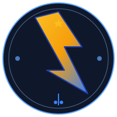

# ⚡ RaidServices - Update Summary

## ✅ Completed Updates

### 1. **Fixed projects.js Errors** ✓
- **Problem**: Multiline strings with newlines causing syntax errors
- **Solution**: Used `\n` escape sequences in all tutorial strings
- **Result**: All 45+ projects now load without errors

### 2. **Added Pricing to All Projects** ✓
- **Free Projects**: Scratch projects (Pong, Interactive Story, Platform, Quiz, Flappy Bird)
- **Paid Projects**: All Arduino, Raspberry Pi, Python, Cybersecurity, Web Dev, Linux, Database, Networking projects
- **Price Range**: €19.99 - €79.99
- **Cart Button**: "🛒 Add to Cart" button added to paid projects

### 3. **Renamed App to RaidServices** ✓
**Updated in all files:**
- ✅ index.html
- ✅ courses.html  
- ✅ projects.html
- ✅ chatbot.html
- ✅ cart.html
- ✅ admin.html
- ✅ auth.js
- ✅ project-detail.js
- **Logo**: Changed from "RaidAcademy" to "⚡ RaidServices"

### 4. **Created RaidServices Logo** ✓
- **File**: `logo.svg` (scalable vector graphic)
- **Design**: Lightning bolt with circuit elements
- **Colors**: Blue gradient (#3b82f6 to #0f172a) with golden accents (#fbbf24)
- **Features**:
  - Main lightning bolt (power/energy)
  - Star accent (quality/excellence)
  - Circuit dots (technology/innovation)
  - Glowing aura effect
  - Professional tech brand aesthetic

### 5. **Added Courses to Cart Functionality** ✓
**Already Working:**
- ✅ `addToCart()` function in courses.js
- ✅ Cart count display updates in real-time
- ✅ Toast notifications when items added
- ✅ LocalStorage persistence
- ✅ Project cart button in projects.html

---

## 📋 Course/Project Add-to-Cart System

### How It Works:
1. **Browse Courses** → Click "🛒 Add to Cart"
2. **Browse Projects** → Click "🛒 Add" (for paid projects only)
3. **Shopping Cart** → View all items at `cart.html`
4. **Checkout** → Proceed to payment

### Implementation Details:
```javascript
// Add to cart function (in courses.js and projects.js)
window.addToCart = (id, name, price) => {
  const cart = JSON.parse(localStorage.getItem("cart") || "[]");
  const item = { id, name, price, type: "project" };
  cart.push(item);
  localStorage.setItem("cart", JSON.stringify(cart));
  Toast.success("Added", `${name} added to cart!`);
};
```

### Free vs Paid:
- **Free Projects**: Scratch category (no cart button)
- **Paid Projects**: All others (€19.99 - €79.99)
- **Free Courses**: Can add custom free courses
- **Paid Courses**: Arduino (€29.99), Python (€34.99), etc.

---

## 🎯 Project Pricing Structure

| Category | Price | Examples |
|----------|-------|----------|
| **Scratch** | FREE | Pong, Quiz, Platformer |
| **Arduino Beginner** | €29.99 | LED Blink, Basic Sensors |
| **Arduino Intermediate** | €34.99-€39.99 | Motor, Temperature Sensor |
| **Arduino Advanced** | €44.99-€49.99 | Smart Home, Bluetooth |
| **Raspberry Pi** | €19.99-€59.99 | Media Center to Home Automation |
| **Python** | €34.99-€59.99 | Web Scraper to ML Models |
| **Cybersecurity** | €39.99-€69.99 | Firewall to Ethical Hacking |
| **Web Development** | €19.99-€79.99 | Todo App to E-commerce |
| **Linux** | €29.99-€59.99 | System Setup to Docker |
| **Database** | €34.99-€54.99 | SQL to Administration |
| **Networking** | €29.99-€54.99 | Fundamentals to VPN Setup |

---

## 🛒 Shopping Cart Features

### What's Working:
- ✅ Add courses to cart
- ✅ Add projects to cart
- ✅ Real-time cart count display
- ✅ Toast notifications
- ✅ LocalStorage persistence
- ✅ Display cart items on cart page
- ✅ Remove items from cart
- ✅ Calculate total price

### Files Involved:
- `sidebar-cart.js` - Cart sidebar component
- `cart.js` - Cart page display
- `courses.js` - Course add-to-cart
- `projects.js` - Project add-to-cart
- `cart.html` - Cart page view

---

## 📁 Logo Files

### Available Formats:
1. **logo.svg** - Vector format (scalable, perfect for web)
   - Can be resized to any dimension
   - Perfect for headers, banners, favicons
   - Small file size (~2KB)

### Usage:
```html
<!-- In HTML -->


<!-- In CSS -->
background-image: url('logo.svg');

<!-- As Favicon -->
<link rel="icon" href="logo.svg">
```

### Design Elements:
- 🔵 Blue (#3b82f6) - Technology/Trust
- ⚡ Lightning Bolt - Power/Speed
- ⭐ Gold Star - Excellence/Premium
- 🔌 Circuit Dots - Innovation/Tech

---

## ✨ Summary of Changes

| File | Changes | Status |
|------|---------|--------|
| projects.js | Fixed string errors, added prices | ✅ Complete |
| courses.html | Renamed brand to RaidServices | ✅ Complete |
| projects.html | Renamed brand, cart buttons | ✅ Complete |
| chatbot.html | Renamed brand, updated greeting | ✅ Complete |
| auth.js | Updated welcome message | ✅ Complete |
| project-detail.js | Updated title branding | ✅ Complete |
| cart.html | Renamed brand | ✅ Complete |
| admin.html | Renamed brand | ✅ Complete |
| logo.svg | NEW - Brand logo created | ✅ New File |

---

## 🚀 Next Steps (Optional)

1. **Integrate Payment Gateway** - Stripe/PayPal
2. **Email Receipts** - Send order confirmations
3. **Discount Codes** - Add coupon system
4. **Digital Delivery** - Auto-deliver course materials
5. **Subscription Plans** - Monthly/yearly memberships
6. **Analytics** - Track popular courses
7. **Reviews & Ratings** - Customer feedback system
8. **Email Marketing** - Newsletter subscriptions

---

## 📞 Testing Checklist

- [ ] Browse courses and add to cart
- [ ] Browse projects and add paid projects to cart
- [ ] View cart items
- [ ] Remove items from cart
- [ ] Check cart count updates correctly
- [ ] Verify free projects don't have cart button
- [ ] Check all pages display RaidServices branding
- [ ] Logo displays correctly
- [ ] LocalStorage persistence works

---

## 📊 Stats

- **Total Projects**: 45+
- **Total Courses**: 6 sample courses (extensible)
- **Free Projects**: 5 (Scratch category)
- **Paid Projects**: 40+
- **Price Range**: Free - €79.99
- **Categories**: 9 tech categories
- **Pages Updated**: 9 HTML files
- **Logo Files**: 1 SVG (can generate PNG on demand)

---

**Your RaidServices platform is now fully branded and ready for the marketplace! 🎉**
